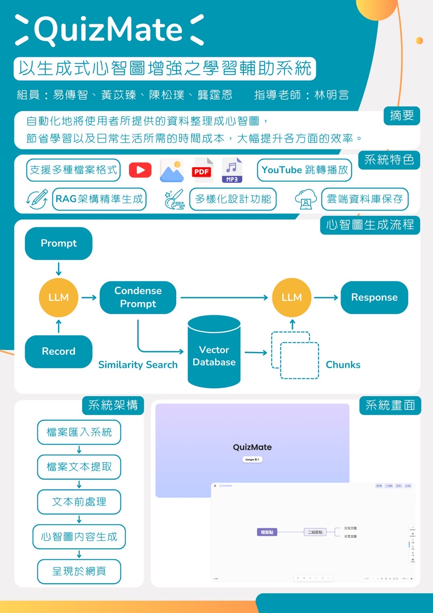
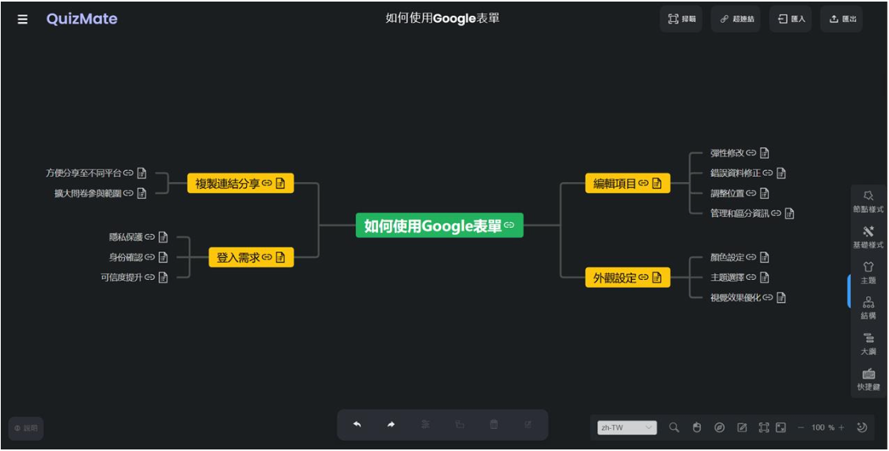

# RAG_MindMap_Generation

A multimedia mind map generation system using Retrieval Augmented Generation (RAG).

The frontend UI is based on an open-source Vue3 mind map project:  
https://github.com/huangyuanyin/hyy-vue3-mindMap

My main contributions focus on backend architecture, multimedia processing pipelines, and RAG-based content generation.

---

# Demo Video

https://www.canva.com/design/DAGWnvrYu4A/OeNx8q4rlMauG9oRV4unHw/watch

## Table of Contents

- [0:00 - 0:30] Introduction  
  This application helps users efficiently learn content through automatically generated mind maps.

- [0:30 - 0:52] Features  
  Multimedia-based generation with a YouTube video example.

- [0:52 - 1:23] RAG System Overview  
  Explanation of the Retrieval Augmented Generation pipeline.

- [1:23 - 1:33] Additional Features  
  Web-based access and editable mind map nodes.

- [1:33 - 1:45] Core Features  
  YouTube timestamp jump functionality and annotations for each node.

- [1:45 - 2:22] Comparison with Existing Mind Map Tools  
  - Coggle: No automatic generation functionality  
  - GitMind: No annotation or timestamp jump support

- [2:22 - 3:15] System Demonstration

---

# Poster



---

# Demo Screenshot



---

# Features

- PDF document parsing
- MP3 audio transcription and processing
- OCR image parsing
- YouTube video parsing
- RAG-based markdown generation
- Firebase cloud storage integration
- Mind map generation
- Google Sign-In authentication
- File management system
- Timestamp-linked YouTube navigation

---

# System Workflow

```text
File Upload to the System (PDF, MP3, JPG, YouTube URL)
↓
Text Extraction (OCR, Whisper, etc.)
↓
Text Preprocessing (Chunking, Embedding, etc.)
↓
Mind Map Content Generation (RAG)
↓
Web Visualization
```

---

# Tech Stack

## Backend

- Python
- Flask
- Firebase
- Firestore
- Firebase Storage

## AI / Processing

- Retrieval Augmented Generation (RAG)
- Whisper
- OCR
- YouTube Data API
- Markdown generation
- FAISS Vector Store
- LangChain

## Frontend

- Vue3
- MindMap visualization

---

# My Contributions

- Flask backend development
- Firebase integration
- Multimedia processing pipeline implementation
- PDF / MP3 / OCR parsing
- YouTube content extraction
- Timestamp-linked YouTube navigation
- RAG-based markdown generation
- AI-powered knowledge structure generation

---

# Notes

- Firebase credentials are excluded from the repository.
- API keys and sensitive information are managed through environment variables.
- Frontend visualization is adapted from an open-source Vue3 mind map project.
- This project was initiated in 2023 and completed in 2024.
